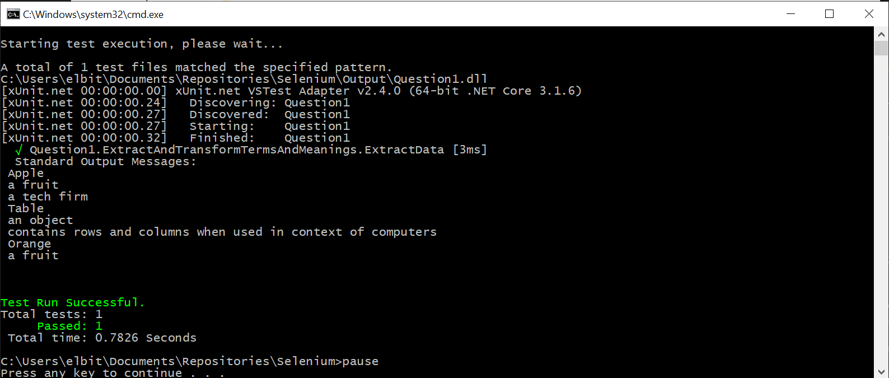

# Weight Watchers Tests
## Prerequisites
* Installed Visual Studio 2019
* Installed WebDriver for Chrome. 
You can download Chrome driver from the [link](ttps://chromedriver.chromium.org/home)
* Place WebDriver to the local folder, add this folder to the Path variable 
* Installed .Net Core 3.1
## Code questions
### Question 1
>There is a file containing a word and its possible meanings (like a Dictionary). The contents of the file look like this:  
>  
>Apple – a fruit, a tech firm  
>Table – an object, contains rows and columns when used in context of computers  
>Orange – a fruit  
>  
>Given a path to the file, do the following:  
>  
>a) Create a method called doesFileExist(String path) which takes the path of the file and tells the user if the file exists at that path or not. Assume all paths are relative to your project structure. If the file does not exist, catch the requisite exception.  
>b) Read each word and its possible meanings and print them out. Your output should look like this:  
>  
>Word1  
>Meaning 1  
>Meaning 2  
>Word2  
>Meaning1  
>Meaning2  
>  
>Use appropriate data structures wherever necessary.
 #### Answer
 Note: 
 I have assumed that each word separate from another part by '–' symbol and there can be only one  possible '–' in the whole line.  Each meaning separate from another by ',' symbol and there is no ',' inside the meaning itself 
 1. Locate the repository folder on disk and click on  runQuestion1.bat
 2. Results should look like
  
  3. Code [url](Question1/ExtractAndTransformTermsAndMeanings.cs) 
 ### Question 3
>Generate 500 random numbers and create a method to print the nth smallest number in a programming language of your choice.
 #### Answer
 Note: 
 I have assumed that random numbers should be generated in a range 1..100.
 1. Locate the repository folder on disk and click on  runQuestion3.bat
 2. Results should look like
  
  3. Code [url](Question3/MinimalNumberInRandomSet.cs) 
## Selenium Tests (Question 2)
### Question 2
>Write an automated test for this scenario using WebDriver.
>The following exercise does not require user login. Please use ID or class as selectors.

>Steps:
>1. Navigate to https://www.weightwatchers.com/us/
>2. Assert loaded page title matches “WW (Weight Watchers): Weight Loss & Wellness Help | WW USA”
>3. On the right corner of the page, click on “Find a Workshop”
>4. Assert loaded page title contains “Find WW Studios & Meetings Near You | WW USA”
>5. In the search field, search for meetings for zip code: 10011
>6. Print the title of the first result and the distance (located on the right of location title/name)
>7. Click on the first search result and then, verify displayed location name/title matches with the name of the first searched result that was clicked.
>8. From this location page, print TODAY’s hours of operation (located towards the bottom of the page)
>9. Create a method to print the number of meeting the each person(under the scheduled time) has a particular day of the week
>e.g. printMeetings("Sun")
>Output should be:
>Person A  3
>Person B  1
### How to run
1. Locate the repository folder on disk and click on runSelenium.bat
2. Wait until tests running, in case of errors repeat from step 2
### How to collect the data
All the output would be visible in Console window. Please see example bellow

### About Selenium tests
I divided requirements on such tests:

#### Test  1: Open Home page, check the page title
Precondition:  Open browser
Steps: Open Home page
Result: Check page title; the page title corresponds to the expected
#### Test 2: Open Find workshop page, check the page title
Precondition:  
1. Open browser
2. Open Home page
Steps: Click on link Find Workshop
Result: The page Find a Workshop was opened, the page title correspond the expected
####  Test 3: Find Location By zip code, check an address and a name
Precondition:
1. Open browser
2. Open Find a Workshop page
Steps:
1. Enter zip code to the search field
2. Press the Search button
3. Click on the first location
Result:
1. Page with information about the location is opened
2. Adress and name corresponds to information that was shown on the page with a search result
####  Test 4: Open Location page and print an operation time
Precondition:
1. Open browser
2. Open Find a Workshop page
Steps:
1. Enter zip code to the search field
2. Press the Search button
3. Click on the first location
4. Print operation time for today
Result:
Operation time for the current day was printed
#### Test 5: Open Location page and print meeting amount for each coach
Precondition:
1. Open browser
2. Open Find a Workshop page
Steps:
1. Enter zip code to the search field
2. Press the Search button
3. Click on the first location
4. Print number of meetings for each coach
Result:
Number of meetings for each coach was printed

