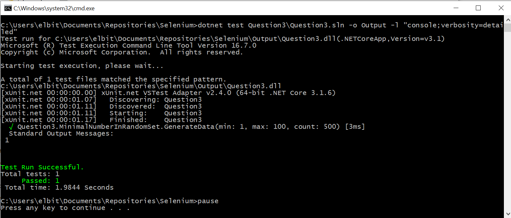

# Weight Watchers Tests
## Prerequisites
* Installed Visual Studio 2019
* Downloaded WebDriver for Chrome 
You can download browser drivers from below links : https://chromedriver.chromium.org/home
* Place WebDriver to the local folder, add this folder to the Path variable 
* Installed .Net Core 3.1
## Code questions
### Question 1
>There is a file containing a word and its possible meanings (like a Dictionary). The contents of the file look like this:  
>  
>Apple – a fruit, a tech firm  
>Table – an object, contains rows and columns when used in context of computers  
>Orange – a fruit  
>  
>Given a path to the file, do the following:  
>  
>a) Create a method called doesFileExist(String path) which takes the path of the file and tells the user if the file exists at that path or not. Assume all paths are relative to your project structure. If the file does not exist, catch the requisite exception.  
>b) Read each word and its possible meanings and print them out. Your output should look like this:  
>  
>Word1  
>Meaning 1  
>Meaning 2  
>Word2  
>Meaning1  
>Meaning2  
>  
>Use appropriate data structures wherever necessary.
 
 ### Question 3
>Generate 500 random numbers and create a method to print the nth smallest number in a programming language of your choice.
 #### Answer
 1. Locate the repository folder on disk and click on  runQuestion3.bat
 2. Results should look like
  
  3. Code [url](Question3/MinimalNumberInRandomSet.cs) 
## Selenium Tests (Question 2)
### How to run
1. Locate the repository folder on disk and click on runSelenium.bat
2. Wait until tests running, in case of errors repeat from step 2
### How to collect the data
All the output would be visible in Console window. Please see example bellow

## About tests
