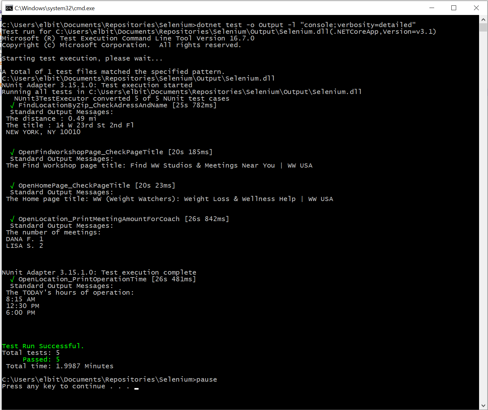

# Weight Watchers Selenium Tests
## How to run
### Prerequisites
* Installed Visual Studio 2019
* Downloaded WebDriver for Chrome 
* You can download browser drivers from below links : https://chromedriver.chromium.org/home
* Place WebDriver to the local folder, add this folder to the Path variable 
* Installed .Net Core 3.1
### How to run
1. Clone or download the repository
2. Locate the repository folder on disk and click on run.bat
3. Wait until tests running, in case of errors repeat from step 2
### How to collect the data
All the output would be visible in Console window. Please see example bellow

## About tests
